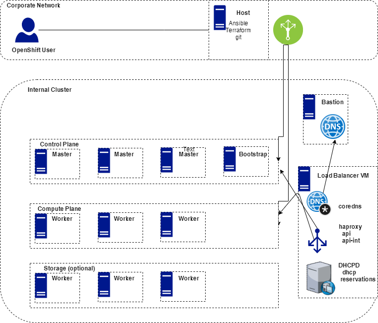
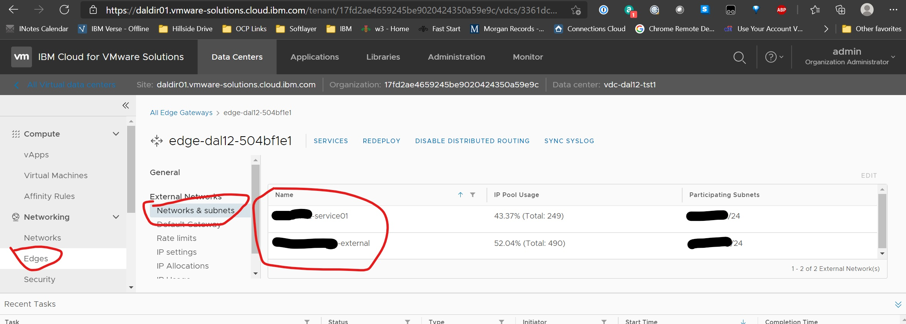
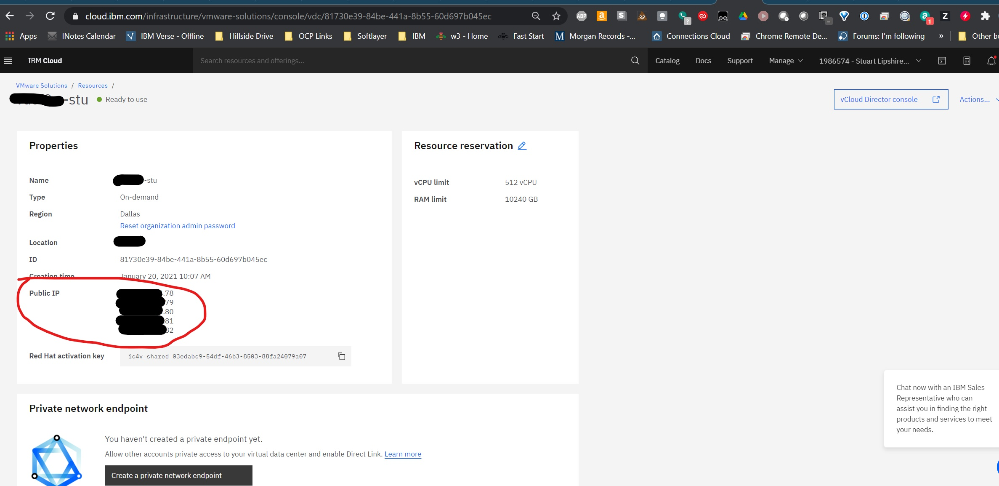
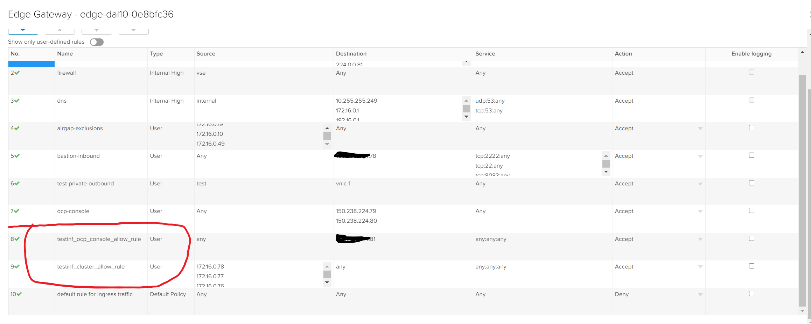
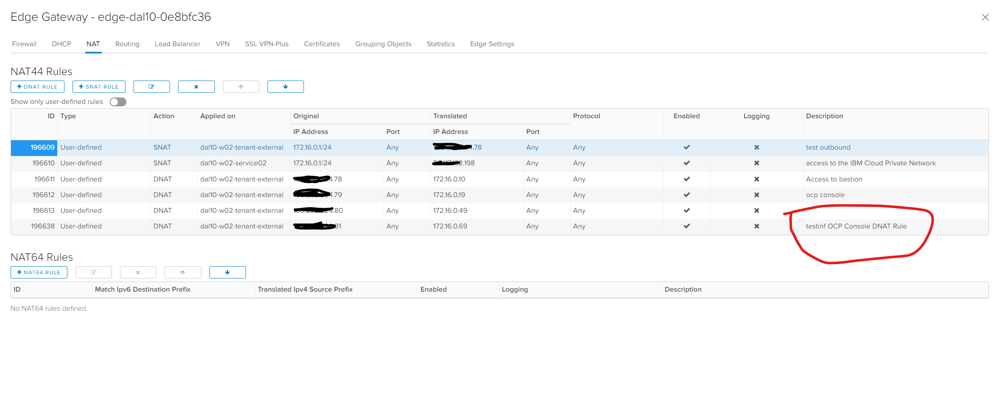

# OpenShift Installation on IBM Cloud VMWare Solutions Shared based on VMWare Cloud Director
## Overview
Deploy OpenShift on IBM Cloud VMWare Solutions based on VMWare Cloud Director.  This toolkit uses Terraform to automate the OpenShift installation process including the Edge Network configuration, Bastion host creation, OpenShift CoreOS bootstrap, loadbalancer, control and worker node creation. Once provisioned, the VMWare Cloud Director environment gives you complete control of all aspects of you OpenShift environment.

The toolkit provides the flexibility to also configure "airgapped" clusters without Internet access.

See also [IBM Cloud VMWare Solutions Shared overview](https://cloud.ibm.com/docs/vmwaresolutions?topic=vmwaresolutions-shared_overview)

This toolkit performs an OpenShift UPI type install and will provision CoreOS nodes using static IP addresses. The `ignition` module will inject code into the cluster that will automatically approve all node CSRs.  This runs only once at cluster creation.  You can delete the `ibm-post-deployment` namespace once your cluster is up and running.

**NOTE**: OpenShift 4.6 or later is supported. If you need 4.5 or earlier, see the [VCD Toolkit](https://github.com/vmware-ibm-jil/vcd_toolkit_for_openshift) or the `terraform-openshift4-vmware pre-4.6` [branch](https://github.com/ibm-cloud-architecture/terraform-openshift4-vmware/tree/pre-4.6)

**NOTE**: Requires terraform 0.13 or later.  

**Change History:**

  - 6/04/2021:  
      - updates to add additonal network related entries necessary for airgapped install to handle access to mirror. Also trust cert for airgap install.
      - Fix to force bash shell when host machine default shell is not bash (ie Ubuntu). Tested on Ubuntu 20
  - 6/02/2021:
      - We divided the main readme into two documents, one for the setting up the OCP cluster with online path, and other one for setting  up the OCP cluster with airgap path.
      - Created the high level steps for [install OCP cluster for online path](#high-level-steps-for-setting-up-the-cluster-as-online-install)
      - Created the high level steps for [install OCP cluster for airgap path](#high-level-steps-for-setting-up-the-cluster-as-airgap-install)
  - 5/07/2021:
      - Fixed issue with Edge Gateway Network selection in new Data centers. This fix requires 2 new variables to be added to your `terraform.tfvars` file. The 2 variables are `user_service_network_name` and `user_tenant_external_network_name`. See configuration info below for details.
      - Force a yum update of all packages on Bastion during build to resolve incompatibilities with newer packages
  - 4/17/2021:
    - Updated terraform code to fix errors caused by deprecated functions in terraform .15
    - Fixed bug in Airgapped install where additionalTrustBundle cert was not copied into install-config.yaml
    - Placed note on in Airgapped section of readme on how to trust mirror cert on bastion.
    - Added new variable **bastion_disk** which you can set to increase the size of the disk on the bastion so you can host NFS, Mirrors, etc. Default size is 200GB
    - Add fips mode support, default is false
  - 3/5/2021:
    - **Due to networking changes and updated configurations and software on the Bastion, it is recommended that you not reuse an existing VDC and Bastion. You will also need to update your `terraform.tfvars`. There are several new required variables.**
    - Added full creation of Bastion and all networking including creation of vdc network, fw rules, dnat and snat rules.
    - Full install and configure all software on Bastion including dnsmasq, ansible, terraform, oc client, nginx web server for ignition
    - Load terraform repo and terraform.tfvars onto Bastion
    - Load pull-secret and additionalTrustBundle cert if present on host machine.
    - When creating an OCP Cluster, all fw, dnat rules, Bastion /etc/hosts and dsnmasq.conf updates are performed when you create the cluster.


  - 2/18/2021:

   - Airgapped install is now supported. You need to build your own mirror.
   - When you create a cluster, the firewall rules and DNAT rule for that cluster will be automatically created. You should probably delete any DNAT or FW rules that relate to any clusters you have previously built. If you have previously created a Edge Firewall Rule for ALLOW Internet access for all resources on your vcd network, you probably should delete that rule. It will interfere with the new automated Firewall. The automation will add Firewall rules for all the VM's that require it when you create a cluster. You will need to add a new set of variables in your `terraform.tfvars` file. The instructions have been updated to relect this and only create rules for the Bastion server. If you create additional servers in your vcd, outside of the automation, you should add internet access to these servers by following the setup instructions for the Bastion.
   - At the end of the Terraform apply, several (hopefully) useful variables are printed out to help you out. Open an issue if you would like more/less/different info listed.   


- 2/14/2021 - Move explanation for our choice to use DHCP for static IP provisioning.  See https://github.com/ibm-cloud-architecture/terraform-openshift4-vcd/issues/3

- 2/01/2021 - Added "Experimental Flag" "create_vms_only". If you set this flag to true, OCP won't be installed, the vm's will be created and the OCP installer will be loaded to the installer/cluster_id directory. There is currently a bug so when you run `terraform apply` the first time, it fails with some error messages after creation of a few VM's but just run `terraform apply` again and it should complete successfully

- 1/25/2021 - The Loadbalancer VM will be automatically started at install time to ensure that DHCP and DNS are ready when the other machines are started.  

- 1/25/2021 - Create project.  This project is a combination of the terraform scripting from [ibm-cloud-architecture/terraform-openshift4-vmware](https://github.com/ibm-cloud-architecture/terraform-openshift4-vmware) and the setup instructions from [VCD Toolkit](https://github.com/vmware-ibm-jil/vcd_toolkit_for_openshift).
The benefits of this code vs. the VCD Toolkit are:
  - Supports OCP 4.6
  - Supports variable number of workers.  VCD toolkit hardcoded the worker count and  related LoadBalancer configuration.
  - Automatic approval of outstanding CSR's.  No more manual step.
  - Less manual steps overall.  Does not require multiple steps of running scripts, then terraform then more scripts. Just set variables, run terraform, then start VM's.


## Architecture

OpenShift 4.6 User-Provided Infrastructure



## High Level Steps for setting up the cluster as online install
----------------------------------------------------------------
**Note** : Please follow these steps in sequence using the steps below, and come back here to navigate after each section link you click and complete it.

* [Step 1: Order a VCD](#order-a-vcd)
* [Step 2: Installing the Bastion and initial network configuration](#installing-the-bastion-and-initial-network-configuration)
  * [Step 2.1: Setup Host Machine](#setup-host-machine)
  * [Step 2.2: Gather Information for terraform.tfvars](#gather-information-for-terraformtfvars)
  * [Step 2.3: Perform Bastion install and create the online ocp cluster](#perform-bastion-install)
    * [Step 2.3.1: Login to Bastion](#login-to-bastion)
    * [Step 2.3.2: Create the online ocp cluster](#create-the-ocp-cluster)
    * [Step 2.3.3: Client setup](#client-setup)
    * [Step 2.3.4: Validate OpenShift cluster install completion](#validating-openshift-cluster-install-completion)
* [Step 3: Debugging the OCP installation](#debugging-the-ocp-installation)
* [Step 4: Optional Steps](#optional-steps)
  * [Step 4.1: Use SSH Key rather than password authentication for Bastion login](#use-ssh-key-rather-than-password-authentication-for-bastion-login-optional)
  * [Step 4.2: Move SSH to higher port ](#move-ssh-to-higher-port-optional)
  * [Step 4.3: Storage Configuration](#storage-configuration)
    * [Step 4.3.1: Add an NFS Server to provide Persistent storage](#add-an-nfs-server-to-provide-persistent-storage)
    * [Step 4.3.2: Create Openshift Container Storage Cluster for persistent storage](#create-openshift-container-storage-cluster-for-persistent-storage)
    * [Step 4.3.3: Enable Registry](#enable-registry)
* [Step 5: Deleting Cluster (and reinstalling)](#deleting-cluster-and-reinstalling)

## High Level Steps for setting up the cluster as airgap install
----------------------------------------------------------------
**Note** : Please follow these steps in sequence using the steps below, and come back here to navigate after each section link you click and complete it.

* [Step 1: Order a VCD](#order-a-vcd)
* [Step 2: Installing the Bastion and initial network configuration](#installing-the-bastion-and-initial-network-configuration)
  * [Step 2.1: Setup Host Machine](#setup-host-machine)
  * [Step 2.2: Gather Information for terraform.tfvars](#gather-information-for-terraformtfvars)
  * [Step 2.3: Perform Bastion install](#perform-bastion-install)
    * [Step 2.3.1: Login to Bastion](#login-to-bastion)
* [Step 3: Setting up mirror registry on Bastion](docs/airgap-cluster-setup.md#setting-up-mirror-registry)
  * [Step 3.1: Setting up mirror registry](docs/airgap-cluster-setup.md#setting-up-mirror-registry)
  * [Step 3.2: Create a mirror for OpenShift 4.6 images](docs/airgap-cluster-setup.md#create-a-mirror-for-openshift-46-images)
* [Step 4: Create the airgap cluster from Bastion](docs/airgap-cluster-setup.md#create-the-airgap-cluster-from-bastion)
  * [Step 4.1: Copy registry cert in case of registry setup in different VCD](docs/airgap-cluster-setup.md#copy-registry-cert-in-case-of-registry-setup-in-different-vcd)
  * [Step 4.2: Create the airgap cluster](docs/airgap-cluster-setup.md#create-the-airgap-cluster)
  * [Step 4.3: Client setup](#client-setup)
  * [Step 4.4: Validating OpenShift cluster install completion](#validating-openshift-cluster-install-completion)
* [Step 5: Post install cluster configuration](docs/airgap-cluster-setup.md#post-install-cluster-configuration)
  * [Step 5.1: Mirror redhat operators catalog](docs/airgap-cluster-setup.md#mirror-redhat-operators-catalog)
* [Step 6: Storage configuration](docs/airgap-cluster-setup.md#storage-configuration)
* [Step 7: Debugging the OCP installation](#debugging-the-ocp-installation)
* [Step 8: Optional Steps](#optional-steps)
* [Step 9: Deleting Cluster (and reinstalling)](#deleting-cluster-and-reinstalling)


# Installation Process
## Order a VCD
You will order a **VMware Solutions Shared** instance in IBM Cloud(below).  When you order a new instance, a **DataCenter** is created in vCloud Director.  It takes about an hour.

#### Procedure:
* in IBM Cloud > VMWare > Overview,  select **VMWare Solutions Shared**
* name your virtual data center
* pick the resource group.  
* agree to the terms and click `Create`
* then in VMware Solutions > Resources you should see your VMWare Solutions Shared being created.  After an hour or less it will be **ready to use**You will need to edit terraform.tfvars as appropriate, setting up all the information necessary to create your cluster. You will need to set the vcd information as well as public ip's, etc. This file will eventually be copied to the newly created Bastion.


#### Initial VCD setup
* Click on the VMWare Shared Solution instance named from the Resources list
* Set your admin password, and save it
* Click the button to launch your  **vCloud Director console**
* We recommend that you create individual Users/passwords for each person accessing the environment
* Make note of the 5 public ip address on the screen. You will need to use them later to access the Bastion and your OCP clusters
* Note: You don't need any Private network Endpoints unless you want to access the VDC from other IBM Cloud accounts over Private network

# Installing the Bastion and initial network configuration
## Setup Host Machine
You will need a "Host" machine to perform the initial Bastion install and configuration. This process has only been tested on a RHEL8 Linux machine and a Mac but may work on other linux based systems that support the required software. You should have the following installed on your Host:
 - ansible [instructions here](https://docs.ansible.com/ansible/latest/installation_guide/index.html)
 - git
 - terraform [instructons here](https://www.terraform.io/downloads.html)


On your Host, clone the git repository. After cloning the repo, You will need to edit `terraform.tfvars` as appropriate, setting up all the information necessary to create your cluster. You will need to set the vcd information as well as public ip's, etc. Instructions on gathering key pieces of informaton are below.

```
git clone https://github.com/ibm-cloud-architecture/terraform-openshift4-vcd
cd terraform-openshift4-vcd
cp terraform.tfvars.example terraform.tfvars
```
Edit terraform.tfvars per the terraform variables section
## Gather Information for terraform.tfvars

### terraform variables description

| Variable                     | Description                                                  | Type | Default |
| ---------------------------- | ------------------------------------------------------------ | ---- | ------- |
| vcd_url               | for now either https://daldir01.vmware-solutions.cloud.ibm.com/api or https://fradir01.vmware-solutions.cloud.ibm.com/api api                    | string |  |
| vcd_user                     | VCD username                                             | string | - |
| vcd_password             | VCD password                                             | string | - |
| vcd_vdc                      | VCD VDC name          | string | - |
| cluster_id                   | VCD Cluster where OpenShift will be deployed             | string | - |
| vcd_org   |  VCD Org from VCD Console screen |  string |   |
| rhcos_template | Name of CoreOS OVA template from prereq #2 | string | - |
| vcd_catalog   | Name of VCD Catalog containing your templates  | string  |  Public Catalog |
| vm_dns_addresses           | List of DNS servers to use for your OpenShift Nodes (161.26.0.10 is the IBM Cloud Private Network Internal DNS Sever in case you go airgap)          | list   | 8.8.8.8, 161.26.0.10               |
|mac_address_prefix   |  The prefix used to create mac addresses for dhcp reservations. The last 2 digits are derived from the last 2 digits of the ip address of a given machine. The final octet of the ip address for the vm's should not be over 99. |  string |  00:50:56:01:30 |
| base_domain                | Base domain for your OpenShift Cluster. **Note: Don't pick a base domain that is currently registered in Public DNS**.                       | string | -                              |
| bootstrap_ip_address|IP Address for bootstrap node|string|-|
| control_plane_count          | Number of control plane VMs to create                        | string | 3                |
| control_plane_memory         | Memory, in MB, to allocate to control plane VMs              | string | 16384            |
| control_plane_num_cpus| Number of CPUs to allocate for control plane VMs             |string|4|
| control_disk  | size in MB   | string  |  - |
| compute_ip_addresses|List of IP addresses for your compute nodes|list|-|
| compute_count|Number of compute VMs to create|string|3|
| compute_memory|Memory, in MB, to allocate to compute VMs|string|16384|
| compute_num_cpus|Number of CPUs to allocate for compute VMs|string|3|
| compute_disk  | size in MB   | string  |  - |
| storage_ip_addresses|List of IP addresses for your storage nodes|list|-|
| storage_count|Number of storage VMs to create|string|0|
| storage_memory               | Memory, in MB to allocate to storage VMs                     | string | 65536            |
| storage_num_cpus             | Number of CPUs to allocate for storage VMs                   | string | 16               |
| storage_disk  | See OCS doc for sizing info   | string  |  512000 |
| lb_ip_address                | IP Address for LoadBalancer VM on same subnet as `machine_cidr` | string | -                |
| openshift_pull_secret        | Path to your OpenShift [pull secret](https://cloud.redhat.com/openshift/install/vsphere/user-provisioned) | string |              |
| openshift_cluster_cidr       | CIDR for pods in the OpenShift SDN                           | string | 10.128.0.0/14    |
| openshift_service_cidr       | CIDR for services in the OpenShift SDN                       | string | 172.30.0.0/16    |
| openshift_host_prefix        | Controls the number of pods to allocate to each node from the `openshift_cluster_cidr` CIDR. For example, 23 would allocate 2^(32-23) 512 pods to each node. | string | 23               |
| cluster_public_ip |Public IP address to be used for your OCP Cluster Console   |  string |   |
|create_vms_only   |  **Experimental** If you set this to true, running `terraform apply` will fail after bootstrap machine. Just run `terraform apply` again and it should complete sucessfully | bool  | false |
|bastion_disk   |disk size of bastion disk   | string  |  ~200GB |
|openshift_version   |  The version of OpenShift you want to install | string  | 4.6  |
|fips   |  Allows you to set fips compliant mode for install |  bool | false  |
|user_service_network_name   | Service network name from Edge / Networks & Subnets  |  string |  - |
|user_tenant_external_network_name   | Tenant network name from Edge / Networks & Subnets  |  string | -  |
|additional_trust_bundle   |  name of file containing cert for mirror. Read OCP restricted network install doc. Cert name should match DNS name.  | string  |  - |
|**initialization_info object** |   |   |   |
|public_bastion_ip |  Choose 1 of the 5 Public ip's for ssh access to the Bastion.| String  |   |
| machine_cidr | CIDR for your CoreOS VMs in `subnet/mask` format.            | string | -                              |
|internal_bastion_ip   |  The internal ip for the Bastion. Must be assigned an ip address within your machine_addr range. (ex. 172.16.0.10) | string  |   |
|bastion_password   |  Initial Password for Bastion |  string |   |
|terraform_ocp_repo   |  The github repo to be deployed to the Bastion (usually https://github.com/ibm-cloud-architecture/terraform-openshift4-vcd) | string  |   |
| rhel_key  |  Red Hat Activation key used to register the Bastion.   |  string |   |
|network_name   |  The network name that will be used for your Bastion and OCP cluster (ex. ocpnet) | string  |   |
|static_start_address   |  The start of the reserved static ip range on your network. (ex. 172.16.0.150) | string  |   |
|static_end_address   |  The end of the reserved static ip range on your network (ex. 172.16.0.200) |  string |   |
|bastion_template   |  The vApp Template name to use for your Bastion (ex. RedHat-8-Template-Official ) |  string |   |
|run_cluster_install   |  true or false, if true, the cluster install will be initiated without logging on to the Bastion. The output of the install will be placed in. If the install fails, you can log in to the Bastion and look in /root/cluster_install.log for errors.The install log should normally be transfered back to your Host machine even if the install fails| bool  |   |
|start_vms   | False, not implemented yet)  |  bool |  false |
|**airgapped object** | (only necessary for airgapped install)  |   |   |
|  enabled | set to true for airgapped, false for regular install  |  bool |  false |
|ocp_ver_rel   | Full version and release loaded into your mirror (ex. 4.6.15)  | string  | -  |
|mirror_ip   |  ip address of the server hosting mirro | string  | -  |
| mirror_fqdn  | fqdn of the mirror host. Must match the name in the mirrors registry's cert  |  string | -  |
|  mirror_port | port of the mirror  |string   | -  |
|  mirror_repository |  name of repo in mirror containing OCP install images (currently should be set to `ocp4/openshift4` see RH Doc for details) |  string |  - |


### Find vApp Template from the Image Catalog
We need a catalog of VM images to use for our OpenShift VMs and the Bastion.
Fortunately IBM provides a set of images that are tailored to work for OpenShift deployments.
To browse the available images:
* From your vCloud Director console, click on **Libraries** in the header menu.
* select *vApp Templates*
* There may be several images in the list that we can use, pick the one that matches the version of OCP that you intend to install:
  * rhcos OpenShift 4.6.8 - OpenShift CoreOS template
  * rhcos OpenShift 4.7.0 - OpenShift CoreOS template
  * RedHat-8-Template-Official
* If you want to add your own Catalogs and more, see the [documentation about catalogs](#about-catalogs)

### Networking Info
VCD Networking is covered in general in the [Operator Guide/Networking](https://cloud.ibm.com/docs/vmwaresolutions?topic=vmwaresolutions-shared_vcd-ops-guide#shared_vcd-ops-guide-networking). Below is the specific network configuration required.

Go your VCD console Edge Gateway/External Networks/Networks & Subnets and gather Network the network names. You will need to set the following variables in your `terraform.tfvars` file:
```
user_service_network_name = "<the network name with the word 'Service' in it>"
user_tenant_external_network_name  ="<the network name with the words 'tenant external' in it>"
```



The Bastion installation process will now create all the Networking entries necessary for the environment. You simply need to pick
 - a **Network Name** (ex. ocpnet)
 - a **Gateway/CIDR** (ex. 172.16.0.1/24)
 - an **external** ip for use by the Bastion
 - an **internal** ip for use by the bastion


The Default FW rules created will Deny all traffic except for the Bastion which will have access both to the Public Internet and the IBM Cloud Private Network. DNAT and SNAT rules will be set up for the Bastion to support the above.

When you create a cluster, the FW will be set up as follows.
- The loadbalancer will always have Internet access as it needs to pull images from docker.io and quay.io in order to operate properly.
- If you do not request an airgap install, all workers and masters will be allowed access via the FW
- A DNAT rule will be set up so that you can access you cluster from your workstation regardless of whether or not you requested airgap.

DHCP is not enabled on the Network as it will interfere with the DHCP server running in the cluster. If you have previously enabled it for use in the vcd toolkit, you should now disable it.

You will need to assign static ip addresses, within the Gateway/CIDR range that you defined, for the loadbalance, control plane and workers. You will see sections in `terraform.tfvars`. **The ip addresses can't be defined above x.y.z.99 within your CIDR Range**. These definitions look like this:

```
// The number of compute VMs to create. Default is 3.
compute_count = 3
compute_disk =250000

// The IP addresses to assign to the compute VMs. The length of this list must
// match the value of compute_count.
     compute_ip_addresses = ["172.16.0.74","172.16.0.75"]


// Storage Nodes disk size must be at least 2097152 (2TB) if you want to install OCS

storage_count = 0
storage_disk = 2097152
//storage_ip_addresses = ["172.16.0.76", "172.16.0.77", "172.16.0.78"]
//storage_ip_addresses = ["172.16.0.35"]

```

### Choosing an External IP  for your cluster and Bastion and retrieving the Red Hat Activation key
Configure the Edge Service Gateway (ESG) to provide inbound and outbound connectivity.  For a network overview diagram, followed by general Edge setup instruction, see: https://cloud.ibm.com/docs/vmwaresolutions?topic=vmwaresolutions-shared_vcd-ops-guide#shared_vcd-ops-guide-create-network

Each vCloud Datacenter comes with 5 IBM Cloud public IP addresses which we can use for SNAT and DNAT translations in and out of the datacenter instance.  VMWare vCloud calls these `sub-allocated` addresses.
The sub-allocated address are available in IBM Cloud on the vCloud instance Resources page.
Gather the following information that you will need when configuring the ESG:
* Make a `list of the IPs and Sub-allocated IP Addresses` for the ESG.   



#### Configuring  `initialization_info` in `terraform.tfvars` file

- Take an unused IP and set `cluster_public_ip` and for `public_bastion_ip`
- The Red Hat Activation key can be retrieved from this screen to populate `rhel_key`

- Bastion server install with online path

  **NOTE** If you are trying to install the OCP cluster using online path you should follow this part.

  - Set `run_cluster_install` to true.
  - Your terraform.tfvars entries should look something like this:    
```
 cluster_public_ip  = "161.yyy.yy.yyy"

 initialization_info     = {
    public_bastion_ip = "161.xxx.xx.xxx"
    bastion_password = "OCP4All"
    internal_bastion_ip = "172.16.0.10"
    terraform_ocp_repo = "https://github.com/ibm-cloud-architecture/terraform-openshift4-vcd"
    rhel_key = "xxxxxxxxxxxxxxxxxxxxxx"
    machine_cidr = "172.16.0.1/24"
    network_name      = "ocpnet"
    static_start_address    = "172.16.0.150"
    static_end_address      = "172.16.0.220"
    run_cluster_install     = true
    }
```

- Bastion server install with airgap path

  **NOTE** If you are trying to install the OCP cluster using the airgap path you should follow this part.

  - Set run_cluster_install to false. We need to configure the mirror registry first before we setup the cluster.
  - Your terraform.tfvars entries should look something like this:    
```
 cluster_public_ip  = "161.yyy.yy.yyy"

 initialization_info     = {
    public_bastion_ip = "161.xxx.xx.xxx"
    bastion_password = "OCP4All"
    internal_bastion_ip = "172.16.0.10"
    terraform_ocp_repo = "https://github.com/ibm-cloud-architecture/terraform-openshift4-vcd"
    rhel_key = "xxxxxxxxxxxxxxxxxxxxxx"
    machine_cidr = "172.16.0.1/24"
    network_name      = "ocpnet"
    static_start_address    = "172.16.0.150"
    static_end_address      = "172.16.0.220"
    run_cluster_install     = false
    }
```

#### Retrieve pull secret from Red Hat sites
Retrieve the [OpenShift Pull Secret](https://cloud.redhat.com/openshift/install/vsphere/user-provisioned) and place in a file on the Bastion Server. Default location is `~/.pull-secret`

## Perform Bastion install
Once you have finished editing your terraform.tfvars file you can execute the following commands. Terraform will now create the Bastion, install and configure all necessary software and perform all network customizations associated with the Bastion. The terraform.tfvars file will be copied to the Bastion server. The pull secret and additionalTrustBundle will be copied to the Bastion if they were specified in terraform.tfvars and are in the specified location on the Host machine. If you plan to create the pull secret and additionalTrustBundle on the Bastion directly and didn't put them on your Host, ignore the error messages about the copy failing.
If you set `run_cluster_install     = true`, your OCP cluster will be created automatically once the Bastion is configured. The results of the install can be found either on the Bastion in `/root/cluster_install.log` or on your Host machine in `~/cluster_install.log`.

**NOTE** Please confirm if you have configured the `initialization_info` correctly using details from section [Configuring  initialization_info in terraform.tfvars file](#configuring--initialization_info-in-terraformtfvars-file) for your case before executing further steps.

```
terraform -chdir=bastion-vm init --var-file="../terraform.tfvars"
terraform -chdir=bastion-vm plan --var-file="../terraform.tfvars"
terraform -chdir=bastion-vm apply --var-file="../terraform.tfvars" --auto-approve
```

The result looks something like this:
```
null_resource.setup_bastion (local-exec): PLAY RECAP *********************************************************************
null_resource.setup_bastion (local-exec): 150.239.22.38              : ok=26   changed=26   unreachable=0    failed=0    skipped=0    rescued=0    ignored=0

null_resource.setup_bastion: Creation complete after 3m32s [id=1639642181061551613]

Apply complete! Resources: 6 added, 0 changed, 0 destroyed.

Outputs:

login_bastion = "Next Step login to Bastion via: ssh root@1xxx.xx.xx.38"
```


If you requested that the cluster be installed and it completed successfully, you can skip directly to the **Client Setup** section of the readme as there is no additional commands to run on the Bastion. You can still login to the Bastion to monitor the completion of the OpenShift install.

If the cluster install fails, you wil need to login to the Bastion to correct any errors there and initiate the restart of the install by following the **Login to Bastion** instructions below.

#### Login to Bastion
Use the generated command to login to the Bastion
`ssh root@1xxx.xx.xx.38`
The result should look somthing like this below. You can ignore the messages about registering the Red Hat VM with the activation key as this was done as part of the provisioning

```
To register the Red Hat VM with your RHEL activation key in IBM RHEL Capsule Server, you must enable VM access to connect to the IBM service network.  For more information, see Enabling VM access to IBM Cloud Services by using the private network (https://cloud.ibm.com/docs/services/vmwaresolutions?topic=vmware-solutions-shared_vcd-ops-guide#shared_vcd-ops-guide-enable-access).

Complete the following steps to register the Red Hat VM with your RHEL activation key. For more information about accessing instance details, see Viewing Virtual Data Center instances (https://cloud.ibm.com/docs/services/vmwaresolutions?topic=vmware-solutions-shared_managing#shared_managing-viewing).

1) From the IBM Cloud for VMware Solutions console, click the instance name in the VMware Solutions Shared instance table.

2) On the instance details page, locate and make note of the Red Hat activation key.

3) Run the following commands from the Red Hat VM:

rpm -ivh http://52.117.132.7/pub/katello-ca-consumer-latest.noarch.rpm

uuid=`uuidgen`

echo '{"dmi.system.uuid": "'$uuid'"}' > /etc/rhsm/facts/uuid_override.facts

subscription-manager register --org="customer" --activationkey="${activation_key}" --force
Where:
${activation_key} is the Red Hat activation key that is located on the instance details page.

Last login: Sat Mar  6 01:50:40 2021 from 24.34.132.100
[root@vm-rhel8 ~]#

```
You can look to make sure that your pull secret was copied:
```
[root@vm-rhel8 ~]# ls
airgap.crt  pull-secret
[root@vm-rhel8 ~]#

```
You can now go to the vcd directory. It is now placed in /opt/terraform. You will find your terraform.tfvars in the directory. You can inspect it to ensure that it is complete.
```
[root@vm-rhel8 ~]# cd /opt/terraform/
[root@vm-rhel8 terraform]# ls
bastion-vm      haproxy.conf  lb       media    output.tf  storage  terraform.tfvars          variables.tf  vm
csr-approve.sh  ignition      main.tf  network  README.md  temp     terraform.tfvars.example  versions.tf
[root@vm-rhel8 terraform]#

```

**NOTE** : If you are following the path of creating the airgap cluster path, then skip moving ahead and please go back to the [high level steps for airgap cluster](#high-level-steps-for-setting-up-the-cluster-as-airgap-install) and follow next step in the list.

#### Create the OCP cluster

Update the initialization_info object to set `run_cluster_install` to true as shown in the example below before executing further instructions:    
```
 initialization_info     = {
    public_bastion_ip = "161.xxx.xx.xxx"
    bastion_password = "OCP4All"
    internal_bastion_ip = "172.16.0.10"
    terraform_ocp_repo = "https://github.com/ibm-cloud-architecture/terraform-openshift4-vcd"
    rhel_key = "xxxxxxxxxxxxxxxxxxxxxx"
    machine_cidr = "172.16.0.1/24"
    network_name      = "ocpnet"
    static_start_address    = "172.16.0.150"
    static_end_address      = "172.16.0.220"
    run_cluster_install     = true
    }
```

If your terraform.tfvars file is complete, you can run the commands to create your cluster. The FW, DNAT and /etc/hosts entries on the Bastion will now be created too. The following terraform commands needs to be executed from `/opt/terraform` dir on your bastion server.

```
terraform init
terraform apply --auto-approve
```

#### Client setup

On the **Client** that you will access the OCP Console, (your Mac, PC, etc.) add name resolution to direct console to the **Public IP** of the LoadBalancer in /etc/hosts on the client that will login to the Console UI.
  As an example:
```
  1.2.3.4 api.ocp44-myprefix.my.com
  1.2.3.4 api-int.ocp44-myprefix.my.com
  1.2.3.4 console-openshift-console.apps.ocp44-myprefix.my.com
  1.2.3.4 oauth-openshift.apps.ocp44-myprefix.my.com
```

**NOTE:** On a MAC, make sure that the permissions on your /etc/host file is correct.  
If it looks like this:   
`$ ls -l /etc/hosts
-rw-------  1 root  wheel  622  1 Feb 08:57 /etc/hosts`   

Change to this:  
`$ sudo chmod ugo+r /etc/hosts
$ ls -l /etc/hosts
-rw-r--r--  1 root  wheel  622  1 Feb 08:57 /etc/hosts`


#### Validating OpenShift cluster install completion:
Once terraform has completed sucessfully, you will see several pieces of information display. This data will also be written to `/root/<cluster_id>info.txt` on the Bastion and to` ~/<cluster_id>info.txt` on the Host computer. As sample is below:
```
Apply complete! Resources: 0 added, 0 changed, 0 destroyed.

Outputs:

output_file = <<EOT
Kubeadmin         : User: kubeadmin password: rfbyV-ggmCs-oSKfT-Bfkjt
Public IP         : 161.156.27.227
OpenShift Console : https://console-openshift-console.apps.testfra.cdastu.com
Export KUBECONFIG : export KUBECONFIG=/opt/terraform/installer/testfra/auth/kubeconfig

Host File Entries:

161.156.27.227  console-openshift-console.apps.testfra.cdastu.com
161.156.27.227  oauth-openshift.apps.apps.testfra.cdastu.com


EOT


```
Once you power on the machines it should take about 20 mins for your cluster to become active. To debug see **Debugging the OCP installation** below.

- power on all the VMs in the VAPP.

- The cluster userid and password are output from the `terraform apply` command.
- You can copy the export command generated to define KUBECONFIG. Alternately, you can get the info using the following methods:

  - You can also retrieve the password as follows:  
  cd to authentication directory:  
   `cd <clusternameDir>/auth`
    This directory contains both the cluster config and the kubeadmin password for UI login
 - export KUBECONFIG= clusternameDir/auth/kubeconfig   

    Example:   
   `export KUBECONFIG=/root/terraform-openshift-vmware/installer/stuocpvmshared1/auth/kubeconfig`
- If you want to watch the install, you can  
  `ssh -i installer/stuocpvmshared1/openshift_rsa core@<bootstrap ip>`  into the bootstrap console and watch the logs. Bootstrap will print the jounalctl command when you login: `journalctl -b -f -u release-image.service -u bootkube.service`. You will see lots of messages (including error messages) and in 15-20 minutes, you should see a message about the bootstrap service completing. Once this happens, exit the bootstrap node.

  You can now watch the OpenShift install progress.

`oc get nodes`
```
 NAME                                  STATUS   ROLES    AGE   VERSION
 master-00.ocp44-myprefix.my.com   Ready    master   16m   v1.17.1+6af3663
 master-01.ocp44-myprefix.my.com   Ready    master   16m   v1.17.1+6af3663
 master-02.ocp44-myprefix.my.com   Ready    master   16m   v1.17.1+6af36
```

Watch the cluster operators. Confirm the RH cluster operators are all 'Available'

`watch -n 5 oc get co`

```
NAME                                       VERSION   AVAILABLE   PROGRESSING   DEGRADED   SINCE
authentication                             4.5.22    True        False         False      79m
cloud-credential                           4.5.22    True        False         False      100m
cluster-autoscaler                         4.5.22    True        False         False      89m
config-operator                            4.5.22    True        False         False      90m
console                                    4.5.22    True        False         False      14m
csi-snapshot-controller                    4.5.22    True        False         False      18m
dns                                        4.5.22    True        False         False      96m
etcd                                       4.5.22    True        False         False      95m
image-registry                             4.5.22    True        False         False      91m
ingress                                    4.5.22    True        False         False      84m
insights                                   4.5.22    True        False         False      90m
kube-apiserver                             4.5.22    True        False         False      95m
kube-controller-manager                    4.5.22    True        False         False      95m
kube-scheduler                             4.5.22    True        False         False      92m
kube-storage-version-migrator              4.5.22    True        False         False      12m
machine-api                                4.5.22    True        False         False      90m
machine-approver                           4.5.22    True        False         False      94m
machine-config                             4.5.22    True        False         False      70m
marketplace                                4.5.22    True        False         False      13m
monitoring                                 4.5.22    True        False         False      16m
network                                    4.5.22    True        False         False      97m
node-tuning                                4.5.22    True        False         False      53m
openshift-apiserver                        4.5.22    True        False         False      12m
openshift-controller-manager               4.5.22    True        False         False      90m
openshift-samples                          4.5.22    True        False         False      53m
operator-lifecycle-manager                 4.5.22    True        False         False      96m
operator-lifecycle-manager-catalog         4.5.22    True        False         False      97m
operator-lifecycle-manager-packageserver   4.5.22    True        False         False      14m
service-ca                                 4.5.22    True        False         False      97m
storage                                    4.5.22    True        False         False      53m

```
#### Debugging the OCP installation

As noted above you power on all the VMs at once and magically OpenShift gets installed.  This section will explain enough of the magic so that you can figure out what happened when things go wrong. See Reference section below for deeper debug instructions

When the machines boot for the first time they each have special logic which runs scripts to further configure the VMs.  The first time they boot up using DHCP for network configuration.  When they boot, the "ignition" configuration is applied which switches the VMs to static IP, and then the machines reboot.  TODO how do you tell if this step failed?  Look at the VMs in VCD console to get clues about their network config?

Assuming Bootstrap VM boots correctly, the first thing it does is pull additional ignition data from the bastion HTTP server.  If you don't see a 200 get successful in the bastion HTTP server log within a few minutes of Bootstrap being powered on, that is a problem

Next Bootstrap installs an OCP control plane on itself, as well as an http server that it uses to help the master nodes get their own cluster setup.  You can ssh into boostrap (ssh core@172.16.0.20) and watch the logs.  Bootstrap will print the jounalctl command when you login: `journalctl -b -f -u release-image.service -u bootkube.service` . Look carefully at the logs. Typical problems at this stage are:
  * bad/missing pull secret
  * no internet access - double check your edge configuration, run typical ip network debug

The installer should have created Edge Firewall Rules for the OCP Cluster that look something like this:



The DNAT rule for the OCP Console should look something like this:



## Configuration to enable OCP console login
- The console login information are now output as part of the terraform apply. Alternately, you can retrieve the information as follows:    


```
oc get routes console -n openshift-console

 NAME      HOST/PORT                                                  PATH   SERVICES   PORT    TERMINATION          WILDCARD
 console   console-openshift-console.apps.ocp44-myprefix.my.com          console    https   reencrypt/Redirect   None
```


- From a browser, connect to the "console host" from the `oc get routes` command with https. You will need to accept numerous security warnings as the deployment is using self-signed certificates.
- id is `kubeadmin` and password is in `<clusternameDir>/auth/kubeadmin-password`


## Optional Steps:
### Use SSH Key rather than password authentication for Bastion login (optional)
The Bastion install process will create an ssh key and place it in  `~/.ssh/bastion_id`  

For login to Bastion, you can choose to use SSH Keys and disable password login:
  - edit /etc/ssh/sshd_config and set password authentication to no
  - add your bastion_id.pub ssh key to .ssh/authorised_keys on bastion

### Move SSH to higher port (optional)
If you want to move your ssh port to a higher port to slow down hackers that are constantly looking to hack your server at port 22 then do the following:
1. Edit /etc/ssh/sshd_config and uncomment the line that currently reads #Port 22 and change to your desired port and save file. `systemctl stop sshd` `systemctl start sshd`
2. `semanage port -a -t ssh_port_t -p tcp <your new port number>`
3. Enter:   
`firewall-cmd --add-port=<your new port>/tcp --zone=public --permanent`  
`firewall-cmd --reload`
1. Update your edge FW rule for your Bastion with your new port. (replace port 22 with your new port)

### Storage Configuration

#### Add an NFS Server to provide Persistent storage.
-  [Here is an article on how to set this up](https://medium.com/faun/openshift-dynamic-nfs-persistent-volume-using-nfs-client-provisioner-fcbb8c9344e). Make the NFS Storage Class the default Storage Class   

  `oc patch storageclass managed-nfs-storage -p '{"metadata": {"annotations": {"storageclass.kubernetes.io/is-default-class": "true"}}}'`


#### Create Openshift Container Storage Cluster for persistent storage.
 If you added storage nodes and want to add OCS instead of NFS for storage provisioner, Instructions here -> [Openshift Container Storage - Bare Metal Path](https://access.redhat.com/documentation/en-us/red_hat_openshift_container_storage/4.6/html-single/deploying_openshift_container_storage_using_bare_metal_infrastructure/index#installing-openshift-container-storage-operator-using-the-operator-hub_rhocs)

 `oc patch storageclass ocs-storagecluster-cephfs -p '{"metadata": {"annotations": {"storageclass.kubernetes.io/is-default-class": "true"}}}'`

#### Enable Registry
 - [Enable the OCP Image registry using your NFS Storage](https://docs.openshift.com/container-platform/4.5/registry/configuring_registry_storage/configuring-registry-storage-baremetal.html)
 - [Exposing the Registry](https://docs.openshift.com/container-platform/4.5/registry/securing-exposing-registry.html)


### Deleting Cluster (and reinstalling)
If you want to delete your cluster, you should use `terraform destroy` as this will delete you cluster and remove all resources on VCD, including FW rules. If you manually delete your cluster via the VCD Console, remember to delete the FW rules and DNAT rules associated with your cluster or the reinstall may fail. The FW and DNAT rules should be tagged with your cluster name in the name and/or description fields.

You should keep your installer/cluster_id directory because the ssh keys that you need to access any of the vm's in your cluster are in this directory.

If you delete your cluster and want to reinstall, you will need to remove the installer/cluster_id directory or the install will likely fail when you start the VM's. You will see messages referencing x.509 certificate errors in the logs of the bootstrap and other servers if you forget to delete the directory.

`rm -rf installer/<your cluster id>`

You don't need to recreate your Bastion everytime you want to create a cluster but if you want to recreate you your Bastion, you should first delete any clusters by issuing
 `terraform destroy` followed by
 `terraform -chdir=bastion-vm apply --var-file="../terraform.tfvars" --auto-approve` on your Host machine.

 If you delete the Bastion via some other method, remember to delete the FW, DNAT and SNAT rule associated with the Bastion. They will be tagged with references to the Bastion
